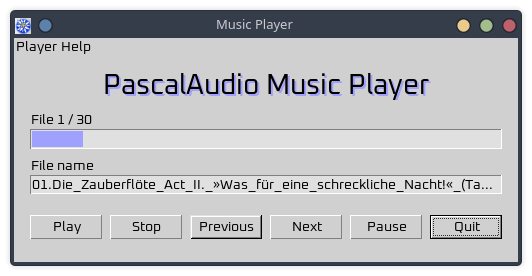

# PascalAudio Music Player

Simple command-line music player based upon [PascalAudio](https://github.com/andrewd207/PascalAudio) and [MSEgui](https://github.com/mse-org/mseide-msegui).

Plays all the sound files found in a directory.

Supported sound formats:

- flac
- mp4
- ogg
- wav

## Usage

```
./player DIRECTORY
```

## Screenshot


